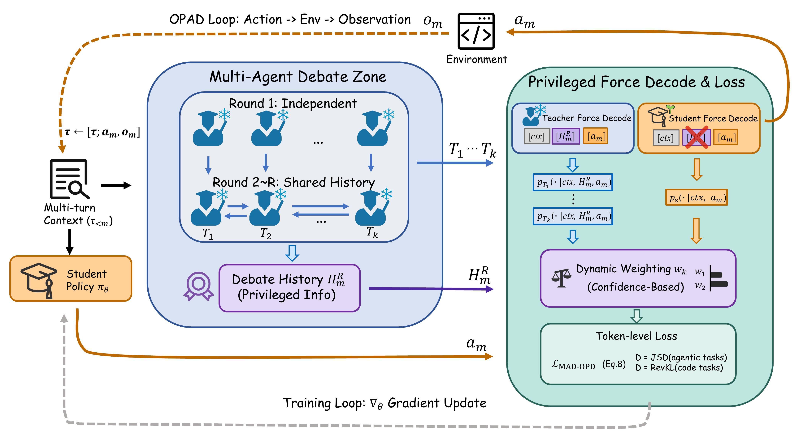
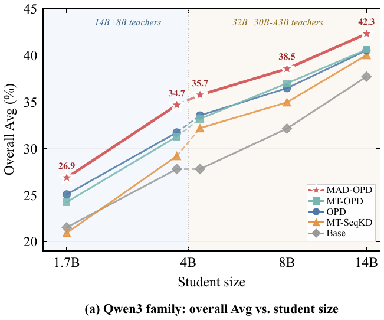
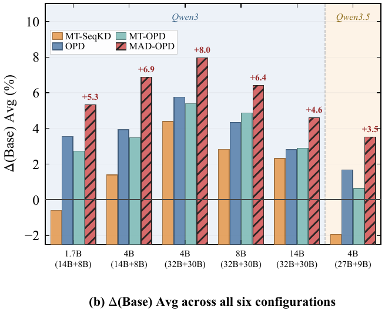

<div align="center">

# MAD-OPD: Breaking the Ceiling in On-Policy Distillation via Multi-Agent Debate

<p>
  <a href="https://arxiv.org/abs/2605.01347"></a>
  <a href="LICENSE"></a>
</p>

</div>

---

## Overview

<p align="center">
  
</p>

At each step, $K$ teachers debate for $R$ rounds to produce a transcript $\mathcal{H}_m^R$ visible only to the teachers, establishing the privileged $p$-$q$ gap. Teachers then force-decode the student's on-policy action and contribute to a confidence-weighted divergence loss; gradients update only the student.

Three contributions:
- **Task-adaptive divergence principle** — JSD for agentic OPD, reverse KL for code generation, derived from per-token gradient stability and mode-coverage analysis.
- **Multi-Agent Debate-driven OPD** — first framework to bring multi-agent debate into the OPD training loop as token-level supervision.
- **OPAD** — On-Policy Agentic Distillation with step-level sampling for stable multi-step agentic training.

---

## Main Results

Across **6 teacher–student configurations** and **5 benchmarks** (BFCL-v4, $\tau^2$-Bench, VitaBench, LiveCodeBench v6, MBPP+), MAD-OPD ranks **first on overall Avg in every configuration**.

| Teachers | Student | Base | MT-SeqKD | OPD | MT-OPD | **MAD-OPD** | $\Delta$ vs. OPD |
|:---|:---:|:---:|:---:|:---:|:---:|:---:|:---:|
| Qwen3 14B+8B   | 1.7B | 21.53 | 20.93 | 25.07 | 24.25 | **26.86** | +1.79 |
| Qwen3 14B+8B   | 4B   | 27.79 | 29.19 | 31.72 | 31.27 | **34.66** | +2.94 |
| Qwen3 32B+30B-A3B | 4B   | 27.79 | 32.18 | 33.54 | 33.18 | **35.74** | +2.20 |
| Qwen3 32B+30B-A3B | 8B   | 32.13 | 34.95 | 36.47 | 36.99 | **38.55** | +2.08 |
| Qwen3 32B+30B-A3B | 14B  | 37.71 | 40.02 | 40.52 | 40.61 | **42.31** | +1.79 |
| Qwen3.5 27B+9B    | 4B   | 34.48 | 32.54 | 36.15 | 35.12 | **37.99** | +1.84 |

**Highlight:** A 4B student trained under our 14B+8B teacher debate **surpasses its 14B teacher on LiveCodeBench v6** by **+4.26 pass@1** and **+10.29 BoN@16** at competitive token cost.

<p align="center">
  
  
</p>

---

## Installation

```bash
pip install -r requirements.txt
```

The default `requirements.txt` targets the **Qwen3** family (Python 3.10, CUDA 12.x, transformers 4.51.1). For the **Qwen3.5** family, see [Qwen3.5 Environment](#qwen35-environment).

---

## Datasets

```bash
# 30K code-only samples from open-thoughts/OpenThoughts3-1.2M
python data/download_code.py    --out ./data_cache/openthoughts_code_30k.jsonl

# Team-ACE/ToolACE (agentic tool-use)
python data/download_toolace.py --out ./data_cache/toolace/data.jsonl
```

---

## Training

Four shell scripts, one per algorithm. Each is a thin wrapper that brings up the vLLM teachers (where needed) and calls `mad_opd.cli.train` with paper-default hyperparameters.

| Script                    | Method                                            |
|---------------------------|---------------------------------------------------|
| `scripts/run_opd.sh`      | single-teacher on-policy distillation             |
| `scripts/run_mt_opd.sh`   | multi-teacher on-policy distillation              |
| `scripts/run_mad_opd.sh`  | **multi-agent debate on-policy distillation**     |
| `scripts/run_mt_seqkd.sh` | multi-teacher sequence-level KD (off-policy)      |

```bash
# Run with paper defaults
bash scripts/run_mad_opd.sh

# Override paths via env vars
STUDENT=/path/to/Qwen3-4B \
TEACHER1=/path/to/Qwen3-14B \
TEACHER2=/path/to/Qwen3-8B \
DATASET=./data_cache/toolace/data.jsonl \
OUTPUT=./outputs/my_run \
bash scripts/run_mad_opd.sh

# Code task (reverse-KL, short prompt / long generation, code-flavored debate prompts)
DATASET=./data_cache/openthoughts_code_30k.jsonl \
bash scripts/run_mad_opd.sh \
    --beta 1.0 --code_mode true \
    --max_length 4096 --max_completion_length 16384

# Agentic ToolACE task (multi-turn split + grouped sampler; uses script defaults)
DATASET=./data_cache/toolace/data.jsonl \
bash scripts/run_mad_opd.sh \
    --toolace_mode true --custom_register_path data/toolace_dataset.py
```

Sequence-length presets per task:

| Task                       | `--max_length` | `--max_completion_length` |
|----------------------------|---------------:|--------------------------:|
| agent (ToolACE, default)   |      **16384** |                  **4096** |
| code  (OpenThoughts)       |       **4096** |                 **16384** |

Both fit inside the teacher vLLM (`max-model-len 32768`, prompt + full debate history + one round's generation) and the force-decode sidecar (`max-length 40960`, prompt + full debate history + the student response).

| Common override                                              | Effect                                                  |
|--------------------------------------------------------------|---------------------------------------------------------|
| `--beta 0.5`                                                 | JSD divergence (agentic, default)                       |
| `--beta 1.0`                                                 | reverse-KL divergence (code)                            |
| `--mad_debate_rounds R`                                      | change debate rounds R (default 2)                      |
| `--code_mode true`                                           | use code-flavored debate prompts                        |
| `--toolace_mode true --custom_register_path data/toolace_dataset.py` | ToolACE multi-turn split + grouped sampler |

For `run_mt_seqkd.sh`, first merge two teacher-generated JSONLs:

```bash
python data/prepare_mt_seqkd.py \
    --teacher1_jsonl t1.jsonl --teacher2_jsonl t2.jsonl --ratio 0.7 \
    --out ./data_cache/seqkd/merged.jsonl
bash scripts/run_mt_seqkd.sh
```

---

## Evaluation

Five adapters drive each benchmark's native CLI — see [`eval/README.md`](eval/README.md).

| Adapter                       | Benchmark         |
|-------------------------------|-------------------|
| `eval/mbpp_plus_eval.py`      | MBPP+             |
| `eval/livecodebench_eval.py`  | LiveCodeBench v6  |
| `eval/bfcl_eval.py`           | BFCL v4           |
| `eval/tau2_bench_eval.py`     | $\tau^2$-Bench    |
| `eval/vitabench_eval.py`      | VitaBench         |

---

## Reference GPU Layout

```
GPU 0       : vLLM Teacher-1 + Force-Decode Sidecar-1
GPU 1       : vLLM Teacher-2 + Force-Decode Sidecar-2
GPU 2..N-1  : Student training (DeepSpeed ZeRO-3)
```

Scripts set `per_device_train_batch_size=1`, `gradient_accumulation_steps=16`, yielding the paper's effective batch size **128** on a **10-GPU node** (8 training + 2 teacher-serving). On a different GPU count, override `--gradient_accumulation_steps` to keep the effective batch at 128:

| machine GPUs | training GPUs | `--gradient_accumulation_steps` |
|-------------:|--------------:|-------------------------------:|
| 4            | 2             | 64                              |
| 6            | 4             | 32                              |
| 10           | 8             | **16** *(default)*              |

```bash
bash scripts/run_mad_opd.sh --gradient_accumulation_steps 16   # 8-GPU node
```

---

## Repository Structure

```
MAD-OPD/
├── mad_opd/             Python package — trainer, args, CLI
├── scripts/             4 run_*.sh + teacher / sidecar launchers
├── data/                dataset download + preprocessing
├── eval/                5 benchmark adapters
├── figures/             illustrations
├── requirements.txt
└── LICENSE              Apache-2.0
```

---

## Qwen3.5 Environment

The Qwen3.5 family (e.g., 27B + 9B teachers, 4B student) requires a newer base image because of architecture changes. Reference image: `nvcr.io/nvidia/pytorch:25.11-py3`.

| Package      | Qwen3 (default `requirements.txt`) | Qwen3.5                            |
|--------------|------------------------------------|------------------------------------|
| Python       | 3.10                               | **3.12**                           |
| CUDA         | 12.x                               | **13.0**                           |
| torch        | `>=2.6.0`                          | **`2.10.*`** (cu130 wheel)         |
| transformers | `4.51.1`                           | **`5.2.0`**                        |
| trl          | `>=0.15,<0.25`                     | **`0.28.0`**                       |
| deepspeed    | latest                             | `0.16.4`                           |
| accelerate   | `>=1.1.0`                          | `1.13.0`                           |
| ms-swift     | `>=3.8`                            | `>=4.0`                            |
| vllm         | `>=0.6`                            | nightly cu130 (`https://wheels.vllm.ai/nightly/cu130`) |

Training scripts, hyperparameters, dataset loaders, and evaluation adapters are unchanged — only the runtime stack moves forward to keep Qwen3.5 model definitions importable.

---

## Citation

If you find this work useful, please cite:

```bibtex
@article{wang2026madopd,
  title   = {MAD-OPD: Breaking the Ceiling in On-Policy Distillation via Multi-Agent Debate},
  author  = {Wang, Jianze and Liu, Ying and Chen, Jinlong and Hu, Xuchun and Zhang, Qilong and Cao, Yu and Wang, Jun and Yang, Hua and Xie, Yong and Chen, Qianglong},
  journal = {arXiv preprint arXiv:2605.01347},
  year    = {2026}
}
```

---

## Acknowledgments

This work was supported by Alibaba Group through Alibaba Research Intern Program.

We build on the open-weight **Qwen3** / **Qwen3.5** model families and evaluate on the public **BFCL-v4**, **τ²-Bench**, **VitaBench**, **LiveCodeBench v6**, and **MBPP+** benchmarks. Training data: **ToolACE** (agentic) and **OpenThoughts3** (code). Implementation builds on [`ms-swift`](https://github.com/modelscope/ms-swift).

---

## License

This project is released under the [Apache License 2.0](LICENSE). Portions of the training code are derived from [`ms-swift`](https://github.com/modelscope/ms-swift), also Apache-2.0.
